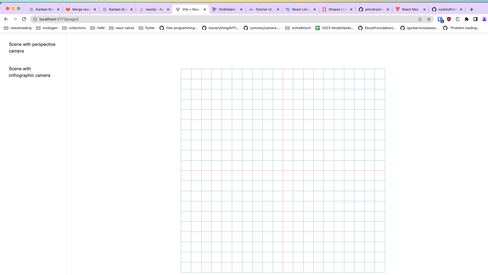

# React frontend intro

## Setup

cd into folder `react`

execute `npm install` to install all required dependencies

run `npm run dev` to start the dev server

access the frontend on `http://localhost:5173/`. It should look like the following. You can use the buttons on the left to switch between the two scenes (orthographic/perspective)


## Tasks

### Task 1

Start the application and go to `Scene with orthographic camera` . This renders a scene with a helper grid and an orthographic camera that looks from top on the displayed grid.



For starters draw a line from -3/0/0 to -3/5/0 on the grid with a thickness of 4 and a color of your choice. Use the [Line component](https://github.com/pmndrs/drei#line) of @react-three/drei.

### Task 2

Your task is to import the walls in `data/task2.ts` into the page2 component (`src/pages/page2.tsx`) and display them in the scene using the [Line component](https://github.com/pmndrs/drei#line) of @react-three/drei. Use a line thickness of 4

_Hint:_

You are able to render an array within your react component like this

```tsx
const AnyReactComponent = () => {
  const array_items = ["banana", "apple", "strawberry"];

  return (
    <>
      <Heading>My favorite fruits</Heading>

      {array_items.map((fruit, index) => (
        <Text key={index}>{fruit}</Text>
      ))}
    </>
  );
};
```

<details>
  <summary>Solution task 2</summary>
  
  Not yet available
</details>
